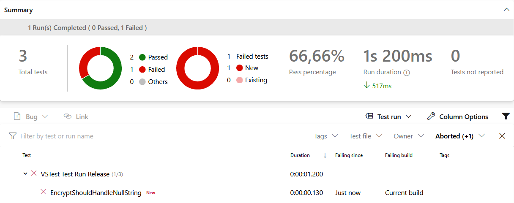

<!--s-->
## Unit Tests schreiben

<!--v-->
### Dirty Tests

* sind schwer wartbar <!-- .element: class="fragment" -->
* macht Produktivcode schwerer wartbar, da Tests mit gepflegt werden müssen <!-- .element: class="fragment" -->
* typische Symptome <!-- .element: class="fragment" -->
  * viele gleiche Tests mit nur subtilen Änderungen <!-- .element: class="fragment" -->
  * ein Refactoring verursacht viele fehlschlagende Tests <!-- .element: class="fragment" -->

<!--v-->
### Test Code ist (fast) wichtiger als Produktivcode

* aus Test Code lässt sich Produtktivcode wieder herstellen <!-- .element: class="fragment" -->
* dokumentiert unser System <!-- .element: class="fragment" -->
* verifiziert Korrektheit des Produktivcodes <!-- .element: class="fragment" -->
* baut Sicherheitsnetz für Erweiterungen und Anpassungen auf <!-- .element: class="fragment" -->

<!--v-->
### Halte deine Tests sauber

* Tests sollten analog zum Produktivcode <!-- .element: class="fragment" -->
  * lesbar 
  * verständlich 
  * einfach 
  * flexibel 
  * frei von Duplikationen 

<!--v-->
### Nutze aussagekräftige Testnamen


<!--v-->
### Nutze aussagekräftige Testnamen


<!--v-->
### Baue jeden Test gleich auf

<div id="left" class="fragment">

* Triple A
  * Arrange
  * Act
  * Assert
</div>

<div id="right" class="fragment">

* BDD - Behavior Driven
  * Given
  * When
  * Then
</div>


<!--v-->
### Baue jeden Test gleich auf
```java
@Test
public void EncryptShouldHandleEmptyString() {
    // Arrange
    var sut = new Rot13Security();

    // Act
    var actual = sut.Encrypt("");

    // Assert
    assertEquals("", actual);
}
```

```csharp
[Test]
public void EncryptShouldHandleEmptyString()
{
    // Arrange
    var sut = new Rot13Security();

    // Act
    var actual = sut.Encrypt(string.Empty);

    // Assert
    Assert.That(actual, Is.EqualTo(string.Empty));
}
```

<!--v-->
### Nutze statische Imports

```java
@Test
public void EncryptShouldHandleNull() {
    Assertions.assertEquals("", _sut.Encrypt(null));
}
```
<!-- .element: class="fragment" -->

```java
import static org.junit.jupiter.api.Assertions.assertEquals;

@Test
public void EncryptShouldHandleNull() {
    assertEquals("", _sut.Encrypt(null));
}
```
<!-- .element: class="fragment" -->

<!--v-->
### Vertausche nicht expected und actual
```csharp
[TestCase("N", "A")]
public void EncryptShouldShiftToStartOfAlphabetWhenItsEndIsReached(string character, string expected)
{
    Assert.AreEqual(_sut.Encrypt(character), expected);
}
```
<!-- .element: class="fragment" -->

```
String lengths are both 1. Strings differ at index 0.
Expected: "["
But was:  "A"
-----------^
```
<!-- .element: class="fragment" -->

<!--v-->
### Nutze Assert.That aus NUnit

```csharp
[TestCase("N", "A")]
[TestCase("O", "B")]
[TestCase("Z", "M")]
public void EncryptShouldShiftToStartOfAlphabetWhenItsEndIsReached(string character, string expected)
{
    Assert.That(_sut.Encrypt(character), Is.EqualTo(expected));
}
```
<!-- .element: class="fragment" -->


<!--v-->
### Fange keine Exceptions im Test

```java
@Test
public void EncryptShouldThrowExceptionWhenNull() {
    try {
        _sut.Encrypt(null);
    }
    catch (NullPointerException e) {
        return;
    }
    assertTrue(false);
}
```
<!-- .element: class="fragment" -->

```java
@Test
public void EncryptShouldThrowExceptionWhenNull() {
    assertThrows(NullPointerException.class, () -> _sut.Encrypt(null));
}
```
<!-- .element: class="fragment" -->

<!--v-->
### Fange keine Exceptions im Test

```csharp
[Test]
public void EncryptShouldThrowExceptionWhenNull()
{
    try
    {
        _sut.Encrypt(null);
    }
    catch (ArgumentNullException e)
    {
        return;
    }
    Assert.Fail();
}
```
<!-- .element: class="fragment" -->

```csharp
[Test]
public void EncryptShouldThrowExceptionWhenNull()
{
    Assert.Throws<ArgumentNullException>(() => _sut.Encrypt(null));
}
```
<!-- .element: class="fragment" -->

<!--v-->
### Nutze Parametrisierung von Tests

```java
@Test
public void EncryptShouldShiftUpperCaseCharacter() {
    assertAll(
            () -> assertEquals("N", _sut.Encrypt("A")),
            () -> assertEquals("O", _sut.Encrypt("B")),
            () -> assertEquals("P", _sut.Encrypt("C")),
            () -> assertEquals("Z", _sut.Encrypt("M"))
    );
}
```
<!-- .element: class="fragment" -->

```java
@ParameterizedTest
@CsvSource({
        "A, N",
        "B, O",
        "C, P",
        "M, Z"
})
public void EncryptShouldShiftUpperCaseCharacter(String character, String expected) {
    assertEquals(expected, _sut.Encrypt(character));
}
```
<!-- .element: class="fragment" -->

<!--v-->
### Nutze Parametrisierung von Tests

```csharp
[Test]
public void EncryptShouldShiftUpperCaseCharacter()
{
    Assert.Multiple(() =>
    {
        Assert.That(_sut.Encrypt("A"), Is.EqualTo("N"));
        Assert.That(_sut.Encrypt("B"), Is.EqualTo("O"));
        Assert.That(_sut.Encrypt("C"), Is.EqualTo("P"));
        Assert.That(_sut.Encrypt("M"), Is.EqualTo("Z"));
    });
}
```
<!-- .element: class="fragment" -->

```csharp
[TestCase("A", "N")]
[TestCase("B", "O")]
[TestCase("C", "P")]
[TestCase("M", "Z")]
public void EncryptShouldShiftUpperCaseCharacter(string character, string expected)
{
    Assert.That(_sut.Encrypt(character), Is.EqualTo(expected));
}
```
<!-- .element: class="fragment" -->

<!--v-->
### Übung - Unit Tests schreiben
<!-- .slide: data-background="img/practice.svg" data-background-size="40%" -->

* Was: [Gilded Rose Refactoring Kata](https://github.com/emilybache/GildedRose-Refactoring-Kata)
* Ziele:
  * Implementierung verstehen
  * Tests für funktionale Anforderungen erstellen
  * Test Coverage beachten
  * Produktiver Code muss nicht angepasst / erweitert werden
