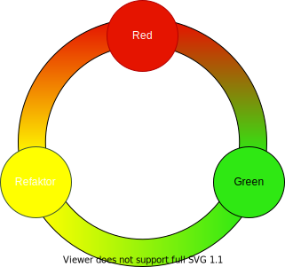

<!--s-->
## Test-Driven-Development (TDD)

<!--v-->
### Ziel

* unzureichende Testabdeckung bei klassischer Entwicklung <!-- .element: class="fragment" -->
  * Tests werden parallel zum oder nach dem System entwickelt <!-- .element: class="fragment" -->
  * es besteht Zeit-/Kostendruck <!-- .element: class="fragment" -->
  * Testerstellung wird als erstes gestrichen <!-- .element: class="fragment" -->
* TDD durchbricht den Zyklus <!-- .element: class="fragment" -->
  * schreibe erst den Test, dann den Produktivcode <!-- .element: class="fragment" -->

<!--v-->
### Vorgehensweise

 <!-- .element: class="fragment" -->

* Red: Testfall für neue Funktionalität <!-- .element: class="fragment" -->
  * Test muss fehl schlagen
  * Red nicht durch NotImplementedException
* Green: Produktivcode für Test  <!-- .element: class="fragment" -->
  * Minimalistische Umsetzung 
  * Test läuft grün durch
* Refactor: Produktiv- und Testcode <!-- .element: class="fragment" -->
  * Code umstellen falls notwendig
  * Keine neue Funktionalität schreiben

<!--v-->
### Vorteile von TDD
* kein ungetesteter Code <!-- .element: class="fragment" -->
* hohe Testabdeckung <!-- .element: class="fragment" -->
* rechtzeitige Refaktorisierungen <!-- .element: class="fragment" -->
* Refaktorisierbarer Codebasis <!-- .element: class="fragment" -->
* stärkere Modularisierung <!-- .element: class="fragment" -->
* kein unnötiger Code <!-- .element: class="fragment" -->

<!--v-->
### Nachteile von TDD
* TDD ist leicht zu erlernen, jedoch schwierig zu meistern <!-- .element: class="fragment" -->
* Benötigt viel Training <!-- .element: class="fragment" -->
* Erfordert Disziplin beim Entwickeln <!-- .element: class="fragment" -->

<!--v-->
### Übung - TDD für Einsteiger
<!-- .slide: data-background="img/practice.svg" data-background-size="40%" -->

* Was: [Function Kata “Tannenbaum”](https://ccd-school.de/coding-dojo/function-katas/tannenbaum/)
* Ziele:
  * Erste Erfahrungen mit TDD machen
  * Rot - Grün - Refactor streng einhalten
  * Probleme und Benefits herausfinden

<!--v-->
### Übung - TDD für Fortgeschrittene
<!-- .slide: data-background="img/practice.svg" data-background-size="40%" -->

* Was: [Class Kata “Bowling”](https://ccd-school.de/coding-dojo/class-katas/bowling/)
* Ziele:
  * TDD beim Erstellen einer ganzen Klasse nutzen
  * Rot - Grün - Refactor streng einhalten
  * Babysteps üben

<!--v-->
### Übung - TDD für Experten
<!-- .slide: data-background="img/practice.svg" data-background-size="40%" -->

* Was: [Game of life](https://codingdojo.org/kata/GameOfLife/)
* Ziele:
  * TDD beim Erstellen von mehreren Klassen nutzen
  * Rot - Grün - Refactor streng einhalten
  * Babysteps verfestigen
  * Integrationstests schreiben
