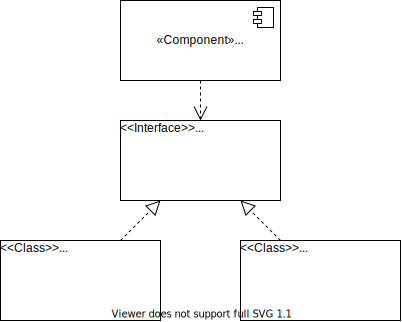

<!--s-->
## Was kommt da noch?

<!--v-->
### Reichen Unit Tests aus?

<!--v-->
<!-- .slide: data-background="https://media.giphy.com/media/vvLWidwZNYH5e/giphy.gif"-->

<!--v-->
### Unit Tests allein reichen nicht

* &shy;<!-- .element: class="fragment" --> **Unit Tests** testen einzelne Komponenten
* &shy;<!-- .element: class="fragment" --> **Integrationstests** testen Zusammenspiel von Komponenten 
* &shy;<!-- .element: class="fragment" --> **Systemtests** testen das gesamte System 
* &shy;<!-- .element: class="fragment" --> **UITests** testen das gesamte System über die UI

<!--v-->
### Testpyramide

* Metapher für optimale Balance der Softwaretests
* Unit Tests haben darin den größten Anteil
* Service Tests beinhalten Api-, Integrations- und Systemtests
* UI Tests sind automatisierte Klicktests

[Martin Fowler - TestPyramid](https://martinfowler.com/bliki/TestPyramid.html)

<!--v-->
### Wie geh ich mit Abhängigkeiten um?

* Fast alle Komponenten haben Abhängigkeiten zu anderen <!-- .element: class="fragment" -->
* verursachen unerwartete Seiteneffekte <!-- .element: class="fragment" -->
* potenziert Testfälle <!-- .element: class="fragment" -->
* testen ist zum Teil unmöglich <!-- .element: class="fragment" -->

<!--v-->
### Wie handhabe ich Abhängigkeiten?

Dependency Injection <!-- .element: class="fragment" -->

 <!-- .element: class="fragment" -->

* Abhängigkeiten extrahieren & injezieren <!-- .element: class="fragment" -->
* Produktivlauf nutzt Produktivcode der Abhängigkeit <!-- .element: class="fragment" -->
* Testlauf nutzt Ersatz für Produktivcode der Abhängigkeit <!-- .element: class="fragment" -->

<!--v-->
### Mocking Frameworks helfen

* Java <!-- .element: class="fragment" -->
  * [JMock](http://jmock.org/)
  * [Mockito](https://site.mockito.org/)
  * [PowerMock](https://github.com/powermock/powermock)
* C# / .NET <!-- .element: class="fragment" -->
  * [NSubstitute](https://nsubstitute.github.io/)
  * [Rhino Mocks](https://www.hibernatingrhinos.com/oss/rhino-mocks)
  * [moq](https://github.com/moq/moq)
  * [Microsoft Fakes](https://docs.microsoft.com/de-de/visualstudio/test/isolating-code-under-test-with-microsoft-fakes?view=vs-2019)

<!--v-->
## Wie bleibe ich mit TDD am Ball?

### Regelmäßiges Üben <!-- .element: class="fragment" -->

* &nbsp;<!-- .element: class="fragment" --> Coding Dojos / Coding Katas
  * [CCD School](https://ccd-school.de/coding-dojo/#cd2)
  * [Kata Log](https://kata-log.rocks/)
  * [Coding Dojo](https://codingdojo.org/)
  * Constraints (4 Rules of Simple Design, Ping Pong, 2 Minutes to Green)
* &nbsp; <!-- .element: class="fragment" --> Holt euch Feedback!
* &nbsp; <!-- .element: class="fragment" --> [Code Retreats](https://www.coderetreat.org/)
* &nbsp; <!-- .element: class="fragment" --> Coding Dojos in der [SWK Magdeburg](https://www.meetup.com/de-DE/Softwerkskammer-Magdeburg/)
